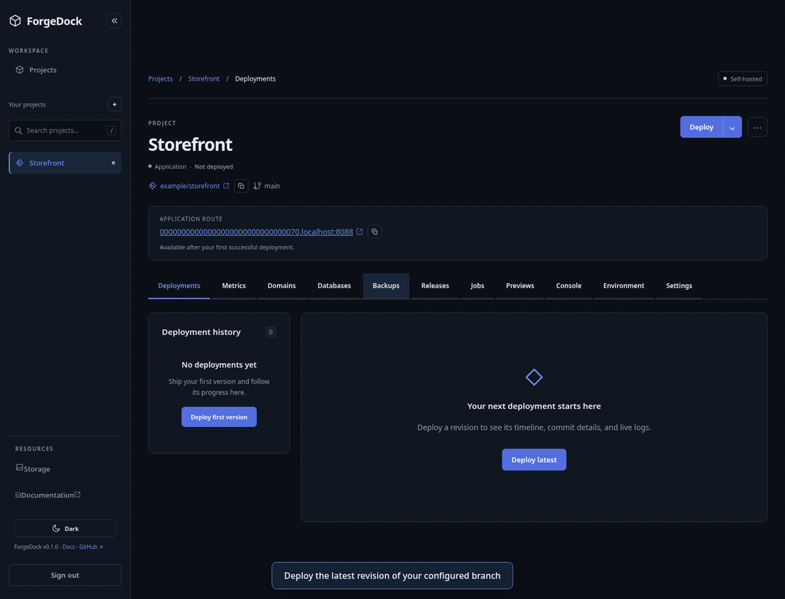

# ForgeDock

**A home for your apps on your Linux server.**

ForgeDock is a hobby project I built to manage applications and Docker containers on my Linux home server. I wanted one place to deploy my projects, check logs, manage databases, and handle the everyday maintenance of a small self-hosted setup.

Connect a Git repository, configure your app, and deploy it from the dashboard. ForgeDock builds the image, starts the containers, checks their health, and updates nginx routing when the release is ready.

[Live documentation](https://docs-forgedock.vercel.app/docs) · [GIF walkthroughs](docs/SHOWCASE.md) · [Getting started](docs/DEVELOPMENT.md) · [Architecture](docs/ARCHITECTURE.md)



*The walkthroughs use the real interface with simulated demo responses.*

## What you can do

| | Features |
| --- | --- |
| **Deploy applications** | Automatic builds with Railpack, Dockerfiles, Docker Compose, public repositories, and private GitHub repositories. |
| **Manage releases** | Deployment history and logs, health checks, retained-image rollback, deployment hooks, and staging-to-production promotion. |
| **Run supporting services** | Private databases with persistent storage, encrypted environment variables, and local or S3-compatible encrypted backups. |
| **Automate maintenance** | Scheduled tasks, GitHub push deployments, pull-request previews, failure notifications, and storage retention. |
| **Inspect your apps** | Container console, application metrics, resource limits, and crash or resource-pressure alerts. |
| **Expose applications** | Local routes, verified custom domains, and optional automatic HTTPS. |

See the [visual guide](docs/SHOWCASE.md) for project setup, deployments, rollback, promotion, and storage cleanup.

## Run it locally

You'll need Linux, Docker Engine, the .NET 10 SDK, Node.js 22.12 or newer, npm, Git, OpenSSL, Bash, and Make. Docker must be running and accessible to your user. See [development setup](docs/DEVELOPMENT.md) for details.

```bash
git clone https://github.com/nikolliervin/ForgeDock.git
cd ForgeDock
./scripts/start-local.sh
```

The launcher prepares the local environment, starts PostgreSQL, nginx, and BuildKit, applies migrations, and starts the API, worker, and dashboard. It preserves an existing `.env`.

- **Dashboard:** <http://127.0.0.1:5173/dashboard> (local Keycloak: <https://localhost:5443>)
- **Documentation:** <http://127.0.0.1:5173/docs> — no sign-in required
- **Sign-in:** configure [Keycloak or another SSO provider](docs/AUTHENTICATION.md) for individual accounts, or use `ForgeDock__ApiToken` in legacy mode.

Press Ctrl+C to stop the application services. Infrastructure containers remain running. After backend updates, rerun the launcher to apply migrations and restart the services.

Manual setup and individual service commands are covered in [the development guide](docs/DEVELOPMENT.md).

## Documentation

| Topic | Guides |
| --- | --- |
| **Build and deploy** | [Automatic builds](docs/AUTOMATIC_BUILDS.md), [Docker Compose](docs/COMPOSE.md), [project templates](docs/PROJECT_TEMPLATES.md) |
| **Release workflows** | [Environment promotion](docs/ENVIRONMENT_PROMOTION.md), [deployment hooks](docs/DEPLOYMENT_HOOKS.md), [automatic rollback](docs/AUTOMATIC_ROLLBACK.md) |
| **GitHub** | [Webhooks and private repository access](docs/GITHUB_WEBHOOKS.md), [pull-request previews](docs/PREVIEW_ENVIRONMENTS.md) |
| **Data and maintenance** | [Database services](docs/DATABASE_SERVICES.md), [backups and restore](docs/BACKUPS.md), [scheduled jobs](docs/SCHEDULED_JOBS.md), [storage cleanup](docs/STORAGE_CLEANUP.md) |
| **Operations** | [Metrics](docs/METRICS.md), [resource controls](docs/RESOURCE_CONTROLS.md), [notifications](docs/NOTIFICATIONS.md), [custom domains and HTTPS](docs/CUSTOM_DOMAINS.md) |
| **Project internals** | [Architecture](docs/ARCHITECTURE.md), [architecture review](docs/ARCHITECTURE_REVIEW.md), [implementation status](docs/IMPLEMENTATION_STATUS.md), [security](docs/SECURITY.md) |

The dashboard also includes public, searchable documentation with deployment and configuration guides.

## How it works

A **React and TypeScript dashboard** talks to an **ASP.NET Core API**. **PostgreSQL** stores configuration, encrypted release snapshots, work queues, and history. A separate **Linux worker** runs Git and Docker commands, checks application health, and manages **nginx** routes.

ForgeDock runs on one host and uses PostgreSQL as its durable queue. See [the architecture](docs/ARCHITECTURE.md) for ownership rules, concurrency, and recovery behavior.

## Project scope

This is a personal home-server project built for a trusted operator. It is intended for self-hosting and learning, with optional allowlisted OpenID Connect SSO accounts or a legacy shared management token. SSO accounts currently have full operator access. It does not isolate hostile builds or provide a managed hosting service.

Crash-time route reconciliation and stronger worker execution fencing remain areas for improvement. Read [the architecture review](docs/ARCHITECTURE_REVIEW.md) and [security notes](docs/SECURITY.md) before exposing an installation publicly.

## License

[MIT](LICENSE) © 2026 nikolliervin.
