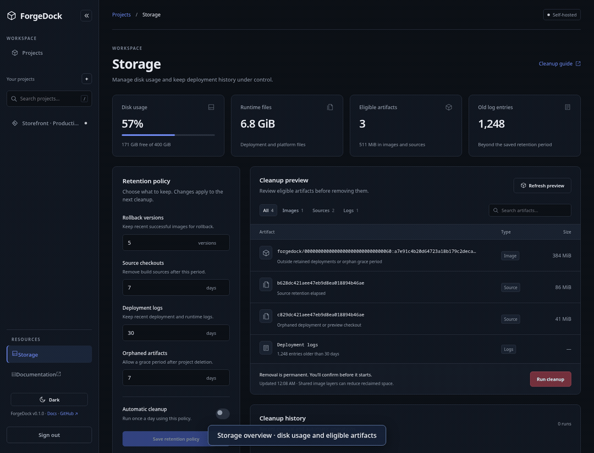
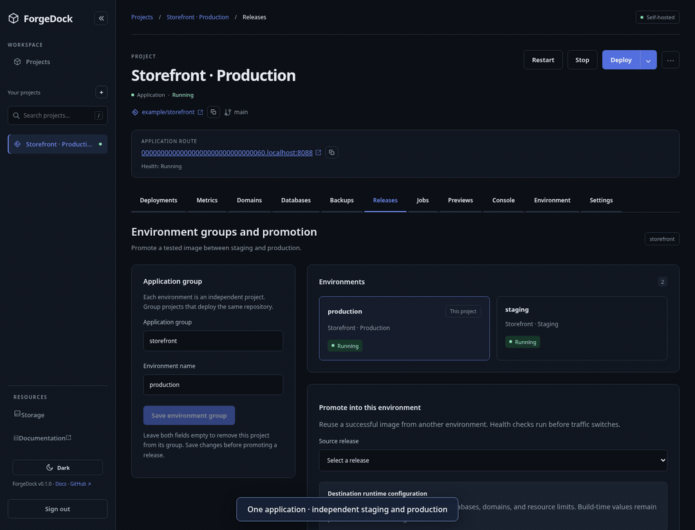
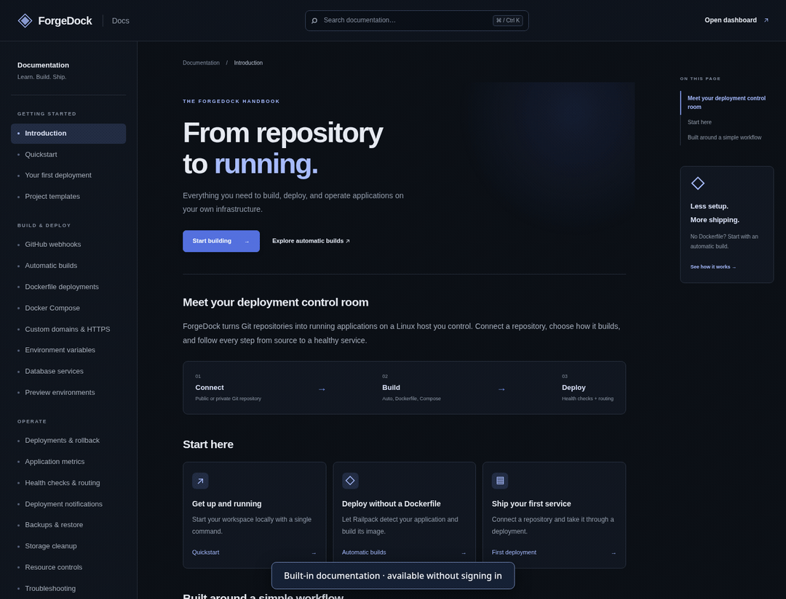

# ForgeDock

A single-host deployment platform for public HTTPS Git repositories and private GitHub repositories with automatic Railpack builds, Dockerfiles, or Docker Compose stacks. The .NET API stores projects and queued deployments in PostgreSQL; a Linux worker builds and starts Docker containers and switches nginx routes after HTTP health checks. React provides the management dashboard.

## See it in action

These short walkthroughs capture the actual ForgeDock interface with demo data and simulated API responses. Cleanup and promotion results are illustrative; recording them does not deploy applications or delete artifacts.

**Storage cleanup** — Review disk usage, save retention rules, filter eligible artifacts, and confirm cleanup.



**Release promotion** — Select a tested staging release and promote its image into production with the destination runtime configuration.



**Built-in documentation** — Search with Ctrl+K, open a guide, and copy example commands.



[Recording instructions](docs/README_RECORDINGS.md) explain how to regenerate these GIFs. Static instructions are available in the [storage cleanup](docs/STORAGE_CLEANUP.md), [environment promotion](docs/ENVIRONMENT_PROMOTION.md), and [automatic builds](docs/AUTOMATIC_BUILDS.md) guides.

Run the local app with one command (requires the prerequisites in [development setup](docs/DEVELOPMENT.md)):

```bash
./scripts/start-local.sh
```

The script prepares the environment, starts PostgreSQL, nginx, and BuildKit, applies migrations, installs frontend dependencies, builds the backend, and starts the API, worker, and dashboard. Press Ctrl+C to stop the app services; PostgreSQL, nginx, and BuildKit remain running. An existing `.env` is preserved.

To run each step manually:

```bash
make init
make infra
make railpack # for projects without Dockerfiles
make compose # for Compose application deployments
make migrate
npm --prefix web ci
# In separate terminals:
make api
make worker
make web
```

Open http://127.0.0.1:5173 and sign in with `ForgeDock__ApiToken` from your private `.env`. Application routes use `http://<project-id-without-hyphens>.localhost:8088`.

Start with [development setup](docs/DEVELOPMENT.md). Read [architecture](docs/ARCHITECTURE.md), [security](docs/SECURITY.md), [implementation status](docs/IMPLEMENTATION_STATUS.md), and [verification results](docs/MVP_VERIFICATION.md) before deploying publicly.

For multiple services, choose Docker Compose, set the repository-relative Compose file, routed service, and its internal port. See [Compose support](docs/COMPOSE.md).

Choose **Auto** to build repositories without a Dockerfile. See [automatic builds](docs/AUTOMATIC_BUILDS.md) for setup and command overrides.

The built-in React documentation lives at http://127.0.0.1:5173/docs and is available without signing in. Built frontend hosting also serves documentation routes from the API.

Custom application domains and automatic HTTPS are available through the project **Domains** tab after configuring a public server. See [custom domains setup](docs/CUSTOM_DOMAINS.md). Local development remains on loopback by default.

See [application metrics](docs/METRICS.md) for resource history, collection behavior, and bulk environment imports.

### Private GitHub repositories

Set `ForgeDock__GitHubToken` in the server `.env` to a fine-grained personal access token scoped to the repositories you deploy with **Contents: Read-only**. Obtain any required organization approval, then restart the worker. Use the normal `https://github.com/owner/repo.git` project URL. The shared worker credential supports cloning and fetching specific commits for Auto, Dockerfile, and Compose builds; it is not saved in project configuration or passed to builds or application containers. Replace it in `.env` when rotating an expired token. SSH, GitHub Enterprise, private submodules, and package registry authentication are not covered.

### Project console

The Console tab runs shell commands in the active application container (the public service for Compose). The API selects the target from the active deployment, verifies Docker ownership labels and the deployed image, and executes against the immutable container ID using the configured container user. Stopped containers and pending deployment/stop/delete operations block execution. Containers with privileged host access or bind mounts are rejected. Commands need `/bin/sh`; each request starts a fresh shell, returns stdout/stderr and its exit code, and retains at most 64 KiB of output. Requests time out after 30 seconds; commands may continue inside the container after a timeout. Interactive programs are not supported. Console changes outside persistent volumes disappear on redeploy. Commands and output are not stored in deployment logs.

### GitHub auto-deploy

Enable **GitHub auto-deploy** in a project's Settings, then add its payload URL and one-time secret to the repository's GitHub webhook settings. Select JSON payloads and push events. Matching pushes queue the exact commit with the project's current saved configuration; repeated deliveries are ignored. Secrets are encrypted, can be rotated, and are never returned by normal reads. A public HTTPS webhook endpoint is required. Test locally with a Cloudflare Quick Tunnel using the [step-by-step setup and troubleshooting guide](docs/GITHUB_WEBHOOKS.md). The same guide is available at `/docs/github-webhooks` in the dashboard.

### Project services and automation

- [Deployment notifications](docs/NOTIFICATIONS.md): encrypted Slack/Discord webhooks and existing SMTP, with durable retries and exact deployment log links.
- [Database services](docs/DATABASE_SERVICES.md): private PostgreSQL, Redis, MySQL, SQL Server Express, and MongoDB with persistent volumes, and encrypted connection variables.
- [Backups and restore](docs/BACKUPS.md): scheduled encrypted snapshots, S3-compatible off-host storage, retention, and confirmed local or remote restoration.
- [PR preview environments](docs/PREVIEW_ENVIRONMENTS.md): isolated deployments and databases, unique URLs, and close-event cleanup.
- [Automatic rollback](docs/AUTOMATIC_ROLLBACK.md): release observation windows, repeated-failure recovery, and notifications.
- [Deployment hooks](docs/DEPLOYMENT_HOOKS.md): timed before/after routing commands with recorded results and failure recovery.
- [Environment promotion](docs/ENVIRONMENT_PROMOTION.md): staging/production groups and retained-image releases with independent runtime configuration.
- [Storage cleanup](docs/STORAGE_CLEANUP.md): disk usage, deletion previews, and automatic artifact/log retention.
- [Resource controls](docs/RESOURCE_CONTROLS.md): snapshotted CPU/memory quotas and durable crash/pressure alerts.
- [Project templates](docs/PROJECT_TEMPLATES.md): editable stack defaults and downloadable starter repositories.

All six guides are also available in the built-in documentation. Apply migrations and restart the API and worker after updating the backend; `./scripts/start-local.sh` performs those steps on startup.
