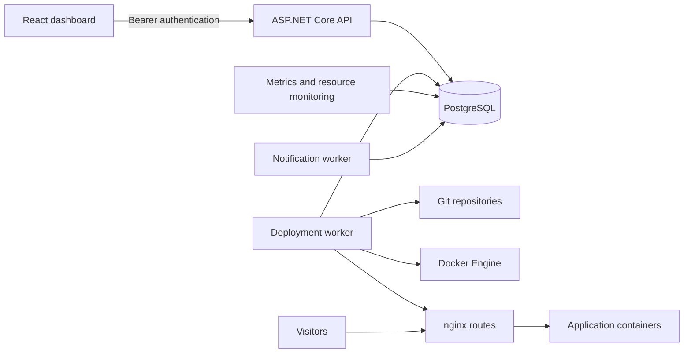

# Architecture

ForgeDock is a single-host deployment platform for a trusted operator. PostgreSQL stores configuration, immutable release snapshots, durable work queues, and history. The authenticated ASP.NET Core API queues work; a separate worker controls Git, Docker, and nginx. React provides URL-addressable project pages and public documentation. See [review](ARCHITECTURE_REVIEW.md) for the changes made before publication.

## Boundaries and patterns

Domain contains entities and lifecycle rules without infrastructure dependencies. Application contains shared validation and parsing. Infrastructure implements persistence, snapshots, encryption, process execution, Docker/Compose/build strategies, and reusable policies. API endpoint modules own HTTP validation and response contracts. Worker partial classes group orchestration by responsibility. This is a pragmatic layered design: Infrastructure contains some policies rather than enforcing a strict application-service boundary.

Direct EF access is intentional. Generic repositories or a message broker would add indirection without improving this single-host workflow. PostgreSQL queues survive restarts; interrupted work fails visibly and retries create new records. Deployment snapshots prevent later project edits from changing already queued work. Image promotion reuses a tested image with the destination project's runtime configuration. Rollback reuses retained release configuration. Hooks have bounded execution and visible results.

## Concurrency and ownership

Management mutations acquire a PostgreSQL transaction advisory lock through `QueueTransactions` before project row locks. Conflicting deployments, stop/delete operations, backups/restores, and task runs check persisted pending work while this lock is held. Commit publishes both the work and its snapshot. Environment mutations and retention also use the gate to avoid duplicate keys and restore-versus-deletion races. Remote retention can hold the gate during storage calls; this favors correctness over management throughput on one host.

Session locks have distinct namespaces: deployment worker `74623019`, queue/storage `74623020`, notification worker `74623021`, resource monitor `74623022`, and metrics collector `74623023`. Independent metrics collection therefore does not accidentally occupy the management queue gate.

Docker labels and deterministic names identify owned resources. Storage cleanup protects active and queued release/task images, previews eligible deletion, and never treats persistent volumes as disposable artifacts. See [storage cleanup](STORAGE_CLEANUP.md), [Compose](COMPOSE.md), and [scheduled jobs](SCHEDULED_JOBS.md).

## Execution and secrets

Processes use argument arrays. They inherit a minimal environment by default; explicitly supplied credentials are scoped to the command that needs them. Persisted output is redacted before per-line truncation. Bounded task/hook capture also masks partial secret suffixes at the capture boundary. Encoded or transformed secrets are outside exact-match redaction guarantees.

Environment values and retained manifests are encrypted with the operator's AES-GCM key. Temporary environment files use exclusive creation and Unix owner-only permissions. Database backup decryption preserves an existing destination if exclusive creation fails. Docker administrators retain access to container configuration.

## Frontend

The dashboard uses shared TypeScript contracts, an in-memory bearer session, a central API hook, and focused project panels. Documentation and the terminal load as separate chunks. Polling resources ignore obsolete responses after navigation and invalidate old requests when mutations refresh data. Notifications and confirmation dialogs share stable context callbacks and clean up timers on unmount.

Jobs and releases use responsive forms and separate task/history or promotion panels. Pending task runs disable conflicting actions. Promotion requires saved grouping and an eligible source. Backend validation remains authoritative. Public documentation supports direct navigation, search, and mobile menus; built frontend hosting provides SPA fallback.

## Persistence and routing

EF migrations are applied explicitly, not implicitly during API startup. Projects own deployment histories, environment records, and related automation; work records preserve execution results. Active deployment and rollback references are orchestration-managed rather than database foreign keys. Queued releases retain encrypted configuration independently of subsequent edits.

A deployment builds or selects its image, starts constrained containers, checks health, replaces the owned nginx file, validates/reloads nginx, updates PostgreSQL, and retires the previous release. Failed candidates preserve the previous application where possible. Cancellation is available for queued deployment work. See the feature guides for Compose, domains, backups, and automatic rollback.

## Remaining limits

This architecture is appropriate to showcase as a trusted-operator, single-host platform. It does not provide multi-user authorization or isolation for hostile Docker builds. A route reload and database commit cannot be atomic; crash-time route reconciliation remains unfinished. Losing worker lock ownership during a long command is not immediately fenced. Deployment-loop health checks and application-log collection can pause during builds, although metrics/resource monitoring run independently. Git egress needs operator restrictions for untrusted repositories. Runtime logs are bounded samples rather than a complete searchable log store. These limits should guide future changes rather than be hidden by additional abstraction layers.
