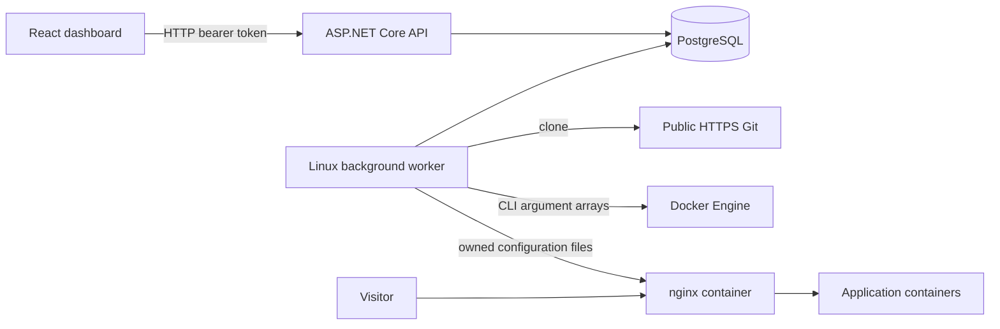
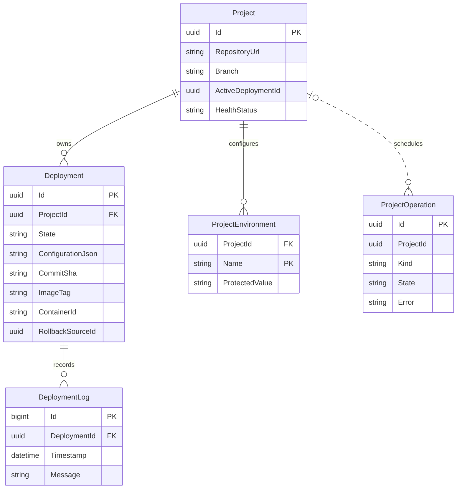
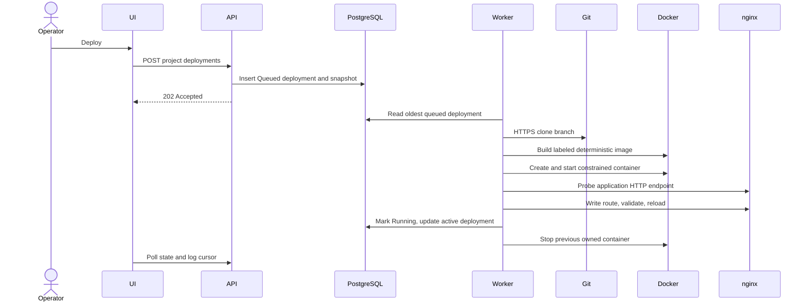
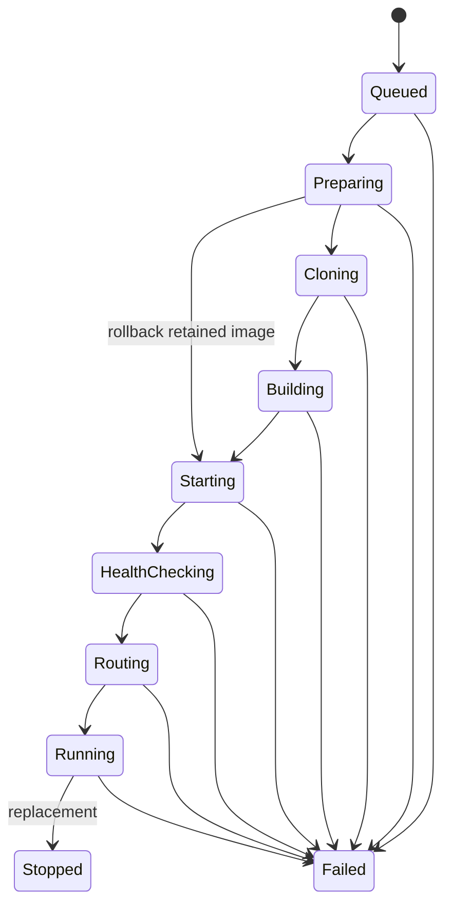

# Architecture

## System overview

ForgeDock targets one trusted operator on one Linux host. Public HTTPS Git repositories with Dockerfiles are deployed to Docker containers. PostgreSQL is the source of truth. A React browser UI uses bearer-authenticated REST endpoints; a separate .NET worker consumes persisted queued deployments. nginx serves application routes. This is an early MVP implementation; see the verification report for actual tested capabilities.

## Repository and boundaries

- `src/ForgeDock.Domain`: project and deployment entities and lifecycle rules. No infrastructure dependencies.
- `src/ForgeDock.Application`: shared project configuration validation. Depends on Domain.
- `src/ForgeDock.Infrastructure`: EF context/migrations, secret encryption, immutable configuration snapshots, and process execution. Depends on Application.
- `src/ForgeDock.Api`: authenticated management endpoints and response DTOs. Depends on Infrastructure.
- `src/ForgeDock.Worker`: queue ownership, Git/build/start/health/route orchestration, application monitoring. Depends on Infrastructure.
- `web`: React/TypeScript dashboard, Vite development proxy, CSS design system.
- `tests`: lifecycle, validation, and cryptographic behavior tests. `web/e2e` exercises the actual browser deployment workflow with Playwright.
- `scripts`: private local credential initialization, infrastructure startup, environment loader.
- `examples/demo`: minimal nginx application fixture with a Dockerfile.
- `docs`: permanent maintainer knowledge and verification reports.

Infrastructure exposes EF directly to hosts instead of introducing generic repository wrappers. Worker orchestration currently belongs to the Worker project; additional build strategies would warrant extracting it into focused application services.

## Frontend

The React dashboard uses local component state and a typed HTTP helper. Authentication stays in memory and disappears on reload. The browser sends the token in an Authorization header; cookies are not used. Vite proxies `/api` to port 5080. The API can alternatively serve `web/dist` through `ForgeDock__WebRoot` for same-origin built frontend hosting. Projects refresh every four seconds, deployment history every two seconds, and cursor-based logs every 1.5 seconds. UI sections include overview, project deployment history/progress/logs, environment variables, and settings. Errors and empty/loading states are rendered explicitly. This first version uses selection state rather than URL routing.

## Database

EF migrations live in Infrastructure and are applied explicitly through the API startup project. There is no implicit startup migration and no manually created application schema.

`ActiveDeploymentId` and `RollbackSourceId` are references maintained by orchestration, without database foreign keys. Snapshots contain repository/build/health configuration and encrypted environment values. Rollback reuses the earlier image and snapshot. Project edits do not alter queued deployments.

## Deployment flow

Failures require a reason. Failed and Stopped deployments are terminal; retry creates a new deployment. There is no user cancellation endpoint. Stop/delete operations have Queued, Running, Completed, and Failed states in a durable operations table; they share the serial worker with deployments. Operations refuse to schedule while deployment work is pending for that project. The operation row survives project deletion and is available through `/api/operations/{id}`. Scheduling prechecks are not transactional fencing, so concurrent management requests still need stronger locking. Worker cancellation interrupts processes; on restart, interrupted nonterminal deployments become Failed with a redeploy instruction. Recovery does not reconcile nginx and database after a crash during route switching; this remains a hardening requirement.

## Docker

Processes use `ProcessStartInfo.ArgumentList`, never shell interpolation. Git prompts, redirects, and alternate protocols are disabled. Docker labels use `io.forgedock.managed`, `io.forgedock.project`, and `io.forgedock.deployment`. Images use `forgedock/<project-id>:<deployment-id>`. Containers use `forgedock-<deployment-id>` and attach to the dedicated `forgedock` network. Applications do not publish host ports. Containers have memory/CPU/PID limits, drop capabilities, and use no-new-privileges. They inherit the image user; arbitrary Docker builds are not sandboxed securely against a hostile tenant.

The old container's deployment ownership label is checked before stopping it. Images and stopped/failed containers are retained; automatic retention cleanup is not implemented. No unrelated containers are enumerated for deletion. Project deletion checks recorded container names and deployment ownership labels, stops/removes those containers, removes the route, and deletes the project with cascading deployment/log/environment rows. Images and source directories remain retained.

## Networking

nginx runs as `forgedock-proxy`, with host port 8088 bound to loopback. `.runtime/routes` is mounted read-only into `/etc/nginx/conf.d` with a Fedora SELinux shared label. Each project has an owned `<project-id>.conf` and a `<project-id>.localhost` server name. Upstreams use Docker network DNS and the configured application port. Configuration is atomically replaced, validated with `nginx -t`, and reloaded. Validation/reload failure restores the previous file. Successful reload and DB commit are not atomic; restart reconciliation is still needed. Initial health probes run through `wget` inside the proxy container. Custom domains, WebSocket proxy settings, and automatic HTTPS are not implemented.

## Background processing and broker

PostgreSQL acts as the durable queue. One worker holds a session advisory lock; a second worker refuses to start. Deployments run serially, which also avoids simultaneous route switches for a project. The worker checks its lock connection between jobs. During a long deployment, loss of the lock connection is not immediately detected; distributed execution needs stronger fencing before multiple hosts can be supported.

There is no RabbitMQ, Kafka, or Redis dependency. Separate broker delivery is unnecessary for one worker; a committed deployment row survives process restart. Delivery is attempted once, interrupted jobs fail visibly, and manual redeployment is the retry strategy. Commands and resource names are deterministic, but complete retry idempotency is not claimed. See ADR 001.

## Logs and observability

Platform logs use Microsoft structured logging, including deployment/project identifiers. Deployment/build output is persisted as numbered log rows. API cursors return at most 500 rows per request; the browser keeps its last 3000 lines. Active application logs are collected every 30 seconds with a 500-line cap. Windows can overlap and logs can be lost during downtime or busy builds. Secrets are redacted by exact string matching before persistence. Do not assume redaction catches encoded or transformed secrets.

Active application HTTP health is checked every 30 seconds when the queue loop is free. `HealthStatus` distinguishes Running, Unhealthy, Stopped, and NotDeployed; deployment state records lifecycle history. Monitoring is delayed during long builds. OpenTelemetry exporters, metrics dashboards, and log retention are not implemented. Liveness and DB readiness endpoints are available.

## Security and configuration

One shared random bearer token grants management access; this is single-operator authentication, not per-user authorization. Secrets use AES-256-GCM with a shared operator-supplied key. Environment lists return names only. Runtime environment files are created with mode 0600 and removed after container creation. Docker administrators can inspect environment values. See [SECURITY.md](SECURITY.md).

Configuration comes from environment variables loaded by the scripts. `ConnectionStrings__ForgeDock`, `ForgeDock__ApiToken`, and `ForgeDock__SecretKey` are required. `ForgeDock__RuntimePath` must be an absolute shared route/source directory. Optional `ForgeDock__Network` and `ForgeDock__ProxyContainer` override infrastructure names. Defaults match the startup script. Keep secrets out of Git and back up the encryption key with the database.

## Decisions, limitations, and evolution

See [ADRs](adr/001-single-host-architecture.md) and [implementation status](IMPLEMENTATION_STATUS.md). Planned improvements include deployment crash reconciliation/fencing, retention and cleanup, API/workflow test breadth, deep-link routing, hardened Git egress, isolated builds, packaged production service supervision, TLS/custom domains, private repositories, and independent monitoring. None is represented as already available.
