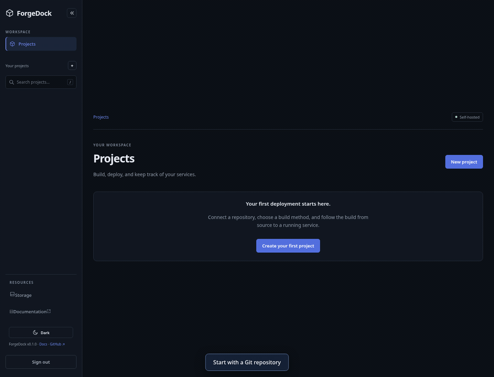
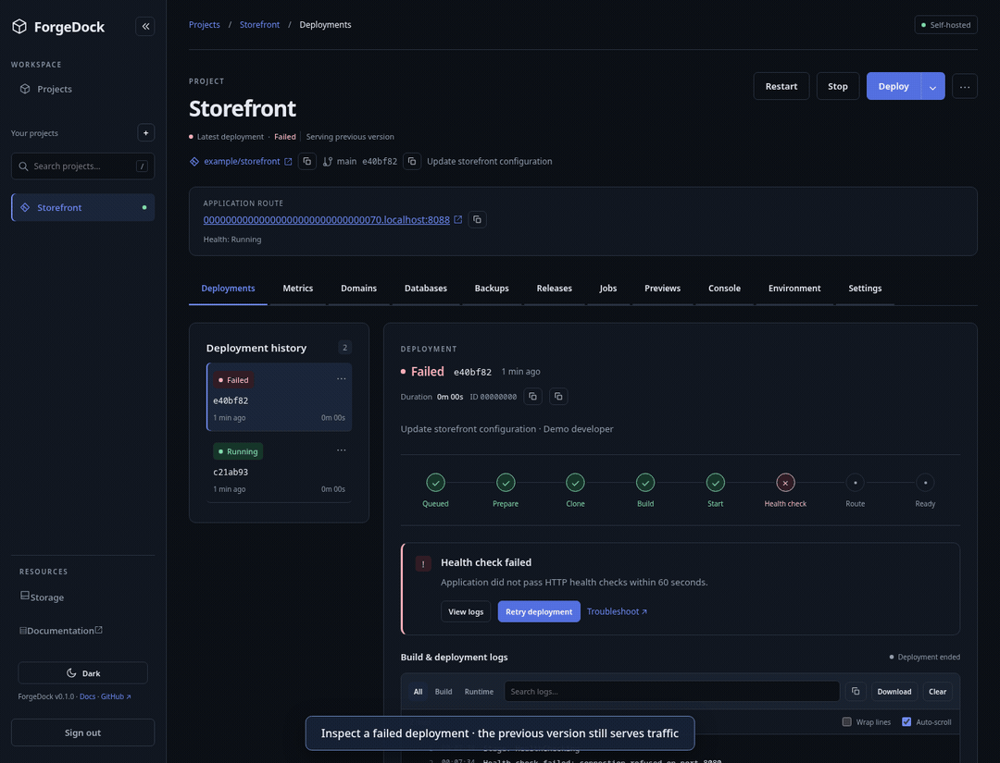

# ForgeDock in action

[← Main README](../README.md) · [Local setup](DEVELOPMENT.md) · [Recording instructions](README_RECORDINGS.md)

Connect a Git repository, configure your application, and follow it from source to a running service. Start with the three core walkthroughs below, then explore release promotion and platform tools.

These GIFs capture the actual ForgeDock interface with synthetic data and intercepted API responses. Deployment stages, health checks, rollback, promotion, and cleanup outcomes are simulated for documentation. They do not demonstrate live infrastructure execution. No real credentials are shown.

## 1. Create and configure an application

Create a project from a repository, choose its branch and build method, then save a masked environment variable. ForgeDock supports automatic Railpack builds, Dockerfiles, and Docker Compose stacks; this example uses **Auto**.

Read more: [First deployment](DEPLOYMENT.md) · [Automatic builds](AUTOMATIC_BUILDS.md) · [Docker Compose](COMPOSE.md)

## 2. Deploy and inspect logs

Queue a release, follow its build and health-check stages, and inspect runtime output. Filter logs by phase and text, then download the visible results.

Read more: [Architecture](ARCHITECTURE.md) · [Verification results](MVP_VERIFICATION.md)

## 3. Recover a previous release

Inspect a failed health check while the previous version keeps serving traffic. Select a successful retained deployment and confirm rollback to its image and original environment. Retained-image rollback skips rebuilding and switches traffic after health checks pass.

Read more: [Automatic rollback](AUTOMATIC_ROLLBACK.md) · [Storage retention](STORAGE_CLEANUP.md)

## More workflows

Expand a walkthrough to view its GIF.

<strong>Promote a tested staging release into production</strong>

Select a release from a grouped staging environment and confirm promotion. Production uses its own runtime configuration while reusing the tested image.

[Environment promotion guide](ENVIRONMENT_PROMOTION.md)

<strong>Preview and clean up old storage artifacts</strong>

Review disk usage, save retention rules, filter eligible artifacts, and confirm cleanup. History shows the queued and completed operation; active releases stay protected.

[Storage cleanup guide](STORAGE_CLEANUP.md)

<strong>Search the built-in documentation</strong>

Use **Ctrl+K** to search guides, open the automatic builds page, and copy example commands. Documentation is available without signing in.

[Automatic builds guide](AUTOMATIC_BUILDS.md)

All GIFs loop automatically. The linked guides provide static instructions, and the [capture script](../web/scripts/record-readme.mjs) makes the walkthroughs reproducible.
